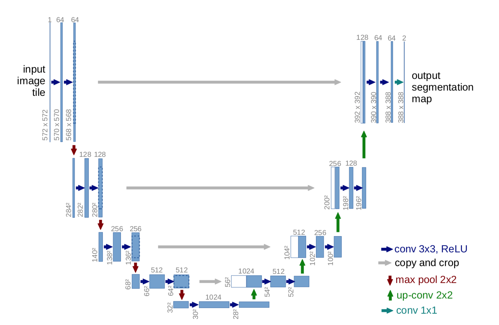

# Brain-Tumor-Segmentation

It uses UNet  Deep learning Architecture. Based on a PyTorch framework MONAI.  
In this project I created a semantic segmentation model using the PyTorch framework called MONAI.
I have applied various data augmentation techniques and have built a UNet deep learning model.
Objective was to learn to use the MONAI framework for applying deep learning to medical images.

 

## UNets

 

## Loss vs Epoch 

 

## Predictions

